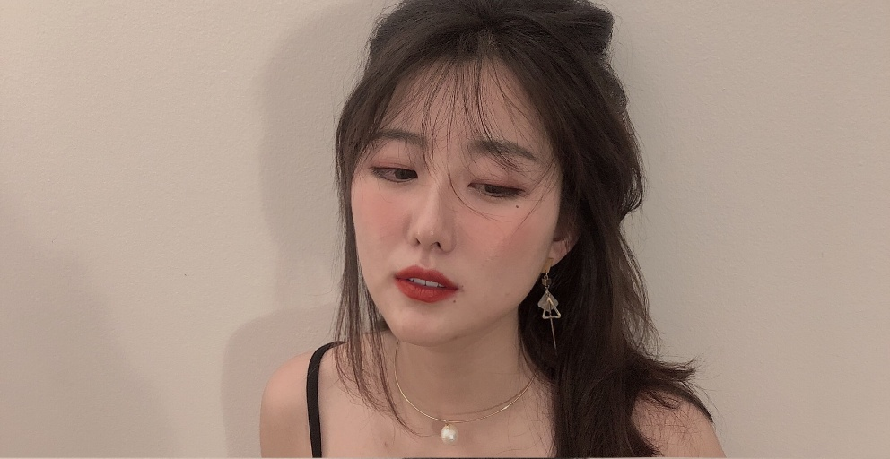
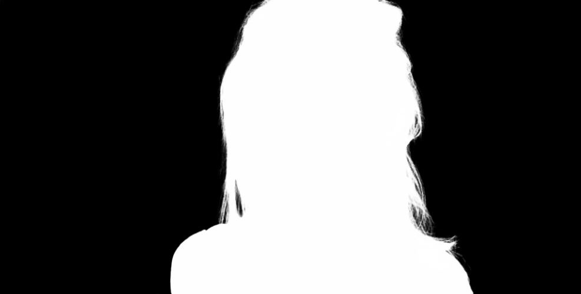

### 简体中文 | [更新记录](https://gitee.com/raoyutian/PaddleSegSharp/blob/master/doc/README_update.md)

#### 如果对你有用或者喜欢，那就给颗星赞，点个赞。谢谢！

## 介绍
-----
本项目是一个基于百度飞桨[PaddleSeg](https://github.com/paddlepaddle/PaddleSeg)项目的人像分割模块而开发的.NET的工具类库。

本项目中PaddleSeg.dll文件是基于开源项目最新发布版本PaddleSeg 2.7[PaddleSeg](https://github.com/paddlepaddle/PaddleSeg)的版本修改而成的C++动态库，基于opencv的x64编译而成的。

PaddleSeg是基于飞桨PaddlePaddle的端到端图像分割套件，内置45+模型算法及140+预训练模型，支持配置化驱动和API调用开发方式，打通数据标注、模型开发、训练、压缩、部署的全流程，提供语义分割、交互式分割、Matting、全景分割四大分割能力，助力算法在医疗、工业、遥感、娱乐等场景落地应用。


本项目只能在X64的CPU上编译和使用，只能在avx指令集上的CPU上使用。

本项目支持飞桨人像抠图的所有模型。PP-MattingV2-512、PP-Matting-512、PP-Matting-1024、PP-HumanMatting、MODNet-MobileNetV2。
默认使用MODNet-MobileNetV2模型。


效果如下：

原图

分离前后背景图

替换蓝色背景结果


本项目目前支持以下.NET框架：

```
net35;net40;net45;net451;net452;net46;net461;net462;net47;net471;net472;net48;net481;
netstandard2.0;netcoreapp3.1;
net5.0;net6.0;net7.0;

```


本项目提供了两个SDK，一个是C++版本，一个是.net版本，.net版本是桥接C++的封装，核心还是C++代码。

##  源码编译
------
   
本项目编译使用opencv4.1.1版本，如需使用其他版本，请自行更换opencv版本编译。

#### 1.文件夹结构

```
PaddleSegSharp               //该文件夹包含.NET对PaddleSeg封装类库项目
Demo                //该文件夹包含PaddleSeg示例Demo文件夹
|--CSharp        //.NET调用示例项目

```

####  .NET版编译

[.NET版编译](https://gitee.com/raoyutian/PaddleSegSharp/blob/master/doc/Csharp.md) 


## 使用与部署
------
#### 1. 在.NET中使用PaddleSegSharp

[在.NET中使用PaddleSegSharp](https://gitee.com/raoyutian/PaddleSegSharp/blob/master/doc/UseInCsharp.md) 

## 模型
------


##  技术交流方式
------
#### QQ技术交流群：818391797。
#### 微信公众号：明月心技术学堂。
#### [个人博客地址： https://www.cnblogs.com/raoyutian/]( https://www.cnblogs.com/raoyutian/)

## 许可证书
------
本项目的发布受Apache 2.0 license许可认证。